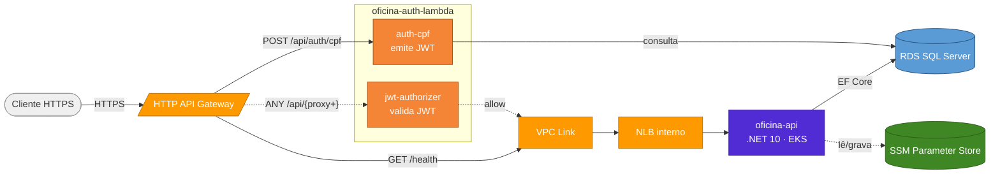
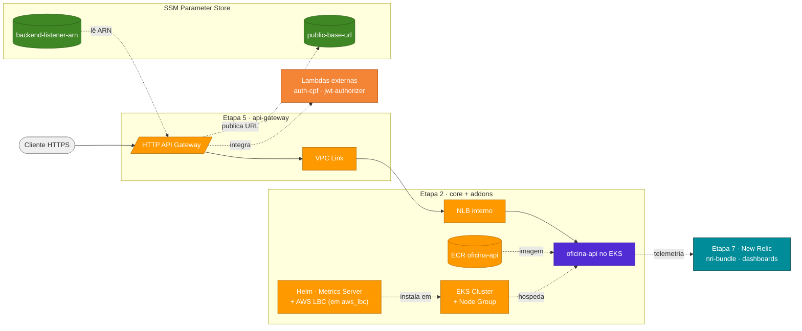

# oficina-infra-k8s

Camada Kubernetes e entrada pública da solução Oficina na AWS.

[]()
[]()
[](https://github.com/fabianorodrigues/oficina-infra-k8s/actions/workflows/terraform-apply.yml)
[](https://github.com/fabianorodrigues/oficina-infra-k8s/actions/workflows/terraform-api-gateway-apply.yml)
[](https://github.com/fabianorodrigues/oficina-infra-k8s/actions/workflows/terraform-observability.yml)

## Sumário

- [Visão geral](#visão-geral)
- [Solução integrada](#solução-integrada)
- [Arquitetura](#arquitetura)
- [Consumido e gerado](#consumido-e-gerado)
- [Pré-requisitos manuais](#pré-requisitos-manuais)
- [Modos do Load Balancer](#modos-do-load-balancer)
- [Configuração](#configuração)
- [Execução](#execução)
  - [Etapa 2 — core + addons](#etapa-2--core--addons)
  - [Etapa 5 — api-gateway](#etapa-5--api-gateway)
  - [Etapa 7 — observabilidade da solução](#etapa-7--observabilidade-da-solução)
- [Validação](#validação)
- [Observabilidade](#observabilidade)
- [Próxima etapa](#próxima-etapa)

---

## <a id="visão-geral"></a> Visão geral

Este repositório concentra as etapas 2, 5 e 7 da solução Oficina. Quatro *roots* Terraform independentes provisionam o ambiente Kubernetes, a entrada pública e a observabilidade da solução:

- **core**: EKS, Node Group, ECR e NLB interno (modo `terraform_nlb`).
- **addons**: Metrics Server via Helm (sempre) e AWS Load Balancer Controller via Helm (apenas em modo `aws_lbc`).
- **api-gateway**: HTTP API, VPC Link, rotas e integrações com a API e as Lambdas.
- **observability**: root Terraform da observabilidade da solução com New Relic (dashboards, alertas, Synthetic Monitor).

Este repositório não constrói imagens, não cria as IAM Roles do EKS (pré-requisito manual) nem provisiona RDS, VPC ou Lambdas — cada camada é responsabilidade do repositório dedicado.

**Tecnologias:** Terraform 1.10+, AWS EKS/ECR/NLB/API Gateway/SSM, Helm, New Relic (adapter), GitHub Actions.

Cada root tem `backend.tf` próprio. State remoto em `s3://<bucket-de-state>/oficina-infra-k8s/<ambiente>/{core|addons|api-gateway|observability}/terraform.tfstate`.

---

## <a id="solução-integrada"></a> Solução integrada

A solução Oficina é composta por 4 repositórios que formam, em conjunto, um sistema de gestão de oficina mecânica na AWS. O diagrama abaixo mostra o **fluxo de runtime** (setas sólidas) e o **fluxo de configuração** entre componentes (setas tracejadas).



| Passo | Repositório | Quando |
|---|---|---|
| 1 | [oficina-infra-db](https://github.com/fabianorodrigues/oficina-infra-db) | sempre |
| **2** | **[oficina-infra-k8s](https://github.com/fabianorodrigues/oficina-infra-k8s) — core + addons** | **sempre — este repositório** |
| 3 | [oficina-api](https://github.com/fabianorodrigues/oficina-api) — 1º deploy | sempre |
| 4 | [oficina-auth-lambda](https://github.com/fabianorodrigues/oficina-auth-lambda) | sempre |
| **5** | **[oficina-infra-k8s](https://github.com/fabianorodrigues/oficina-infra-k8s) — api-gateway** | **sempre — este repositório** |
| 6 | [oficina-api](https://github.com/fabianorodrigues/oficina-api) — redeploy | opcional, se `public-base-url` precisa entrar nos e-mails |
| **7** | **[oficina-infra-k8s](https://github.com/fabianorodrigues/oficina-infra-k8s) — root `observability`** | **sempre — este repositório, após a etapa 5** |

> [!NOTE]
> Na etapa 2, o Metrics Server é sempre instalado (o HPA da API depende dele). O AWS Load Balancer Controller só é instalado quando `LOAD_BALANCER_PROVISIONING_MODE=aws_lbc`.

---

## <a id="arquitetura"></a> Arquitetura



---

## <a id="consumido-e-gerado"></a> Consumido e gerado

**Consome:**

| Origem | Valores | Onde |
| --- | --- | --- |
| `oficina-infra-db` (remote state) | `vpc_id`, `vpc_cidr_block`, `public_subnet_ids`, `private_subnet_ids` | core, api-gateway |
| `oficina-api` (deploy) | Listener ARN gravado no SSM (apenas em `aws_lbc`) | api-gateway |
| `oficina-auth-lambda` (deploy) | Funções `auth-cpf` e `jwt-authorizer` (consumidas por nome via *data source*) | api-gateway |

**Gera:**

| Saída | Consumido por |
| --- | --- |
| `ecr_repository_url`, `cluster_name` (outputs do core) | `oficina-api` (deploy) |
| SSM `/<projeto>/<ambiente>/api/backend-listener-arn` (em `terraform_nlb`) | api-gateway deste repositório |
| SSM `/<projeto>/<ambiente>/api/public-base-url` | `oficina-api` (e-mails) e root `observability` deste repositório |
| `api_gateway_url`, `api_gateway_id` (outputs do api-gateway) | uso operacional e Postman |

---

## <a id="pré-requisitos-manuais"></a> Pré-requisitos manuais

> [!IMPORTANT]
> As duas IAM Roles do EKS abaixo **devem existir antes** do deploy. O Terraform não as cria.

| Role | Trust | Políticas gerenciadas | Secret |
| --- | --- | --- | --- |
| Control plane | `eks.amazonaws.com` | `AmazonEKSClusterPolicy` | `TF_VAR_eks_cluster_role_arn` |
| Node group | `ec2.amazonaws.com` | `AmazonEKSWorkerNodePolicy`, `AmazonEKS_CNI_Policy`, `AmazonEC2ContainerRegistryReadOnly` | `TF_VAR_eks_node_role_arn` |

Listar roles e ARNs:

```powershell
$env:AWS_REGION="<regiao>"

aws iam list-roles --query "Roles[?contains(RoleName,'eks')].{Nome:RoleName,ARN:Arn}" --output table
aws iam get-role --role-name "<nome-da-role>" --query "Role.Arn" --output text
```

---

## <a id="modos-do-load-balancer"></a> Modos do Load Balancer

A variável `LOAD_BALANCER_PROVISIONING_MODE` define quem cria o NLB:

| Modo | Cria o NLB | Grava `backend-listener-arn` no SSM | Addons |
| --- | --- | --- | --- |
| `terraform_nlb` (padrão) | core deste repositório | core deste repositório | Metrics Server |
| `aws_lbc` | AWS Load Balancer Controller via `Service` do `oficina-api` | workflow do `oficina-api` após o `Service` subir | Metrics Server + AWS LBC |

No modo `aws_lbc`, `TF_VAR_aws_load_balancer_controller_iam_mode` define `node` (padrão, herda da role do node group) ou `irsa` (role dedicada com OIDC; recomendado para ambientes produtivos).

---

## <a id="configuração"></a> Configuração

Configure em **GitHub > Settings > Secrets and variables > Actions**.

### Core + addons (etapa 2)

**Secrets obrigatórios**

| Nome | Descrição |
| --- | --- |
| `AWS_ACCESS_KEY_ID`, `AWS_SECRET_ACCESS_KEY`, `AWS_REGION` | Credenciais AWS |
| `TF_STATE_BUCKET` | Bucket S3 do state remoto (compartilhado com o `oficina-infra-db`) |
| `TF_VAR_eks_cluster_role_arn` | ARN da role do control plane (pré-requisito manual) |
| `TF_VAR_eks_node_role_arn` | ARN da role do node group (pré-requisito manual) |

**Secrets adicionais**

| Nome | Descrição |
| --- | --- |
| `AWS_SESSION_TOKEN` | Credenciais temporárias (STS, opcional) |

**Variables com default** (aplicadas pelo workflow)

| Nome | Default | Descrição |
| --- | --- | --- |
| `PROJECT_NAME` | `oficina` | Prefixo lógico |
| `ENVIRONMENT` | `dev` | Ambiente |
| `EKS_CLUSTER_NAME` | `oficina-eks` | Nome do cluster |
| `ECR_REPOSITORY_NAME` | `oficina-api` | Nome do repositório ECR |
| `LOAD_BALANCER_PROVISIONING_MODE` | `terraform_nlb` | `terraform_nlb` ou `aws_lbc` |
| `API_NODE_PORT` | `30080` | NodePort da API (30000–32767) |
| `IMAGE_ALIAS_TAG` | `latest` | Tag mutável aceita no ECR |
| `TF_VAR_aws_load_balancer_controller_iam_mode` | `node` | `node` ou `irsa` (somente em `aws_lbc`) |

Versões de chart Helm têm defaults em [terraform/addons/variables.tf](terraform/addons/variables.tf): `metrics_server_chart_version=3.13.0`, `aws_load_balancer_controller_chart_version=1.8.1`. Customizações podem ser feitas via `terraform.tfvars` local.

### API Gateway (etapa 5)

Reaproveita as credenciais AWS e o `TF_STATE_BUCKET`. Adicional:

| Nome | Tipo | Default | Descrição |
| --- | --- | --- | --- |
| `AUTH_FUNCTION_NAME` | Variable | `oficina-auth-cpf` | Nome da Lambda de autenticação |
| `AUTHORIZER_FUNCTION_NAME` | Variable | `oficina-jwt-authorizer` | Nome da Lambda authorizer |

> [!IMPORTANT]
> Antes de aplicar o `api-gateway`, o SSM Parameter `/<projeto>/<ambiente>/api/backend-listener-arn` deve existir (criado pelo core em `terraform_nlb`, ou pelo deploy da API em `aws_lbc`).

### <a id="observabilidade-da-solução-configuração"></a> Observabilidade da solução (etapa 7)

**Secrets obrigatórios** (quando `ENABLE_NEW_RELIC=true`)

| Nome | Descrição |
| --- | --- |
| `NEW_RELIC_LICENSE_KEY` | License key da Kubernetes Integration |
| `NEW_RELIC_USER_API_KEY` | User API key do provider Terraform New Relic |
| `NEW_RELIC_ACCOUNT_ID` | Account ID New Relic |
| `NEW_RELIC_NOTIFICATION_EMAIL` | E-mail destino das notificações |

**Variables com default**

| Nome | Default | Descrição |
| --- | --- | --- |
| `ENABLE_NEW_RELIC` | `true` | Valor esperado no workflow para aplicar a observabilidade da solução |
| `NEW_RELIC_REGION` | `US` | `US` ou `EU` |
| `API_GATEWAY_URL` | vazio | Override do Synthetic Monitor; se vazio, busca `public-base-url` no SSM |

Chart `nri-bundle` fixado na versão `7.0.8` ([terraform/observability/variables.tf](terraform/observability/variables.tf)).

> [!NOTE]
> O root Terraform usa `enable_new_relic=false` como default seguro e configurável para validação isolada sem credenciais New Relic. No workflow da solução completa, execute com `ENABLE_NEW_RELIC=true`. Em PR/push, o workflow executa apenas `validate`; em `workflow_dispatch`, escolha `apply=false` para `plan` ou `apply=true` para aplicar após a etapa 5, com `/health` respondendo.

---

## <a id="execução"></a> Execução

### <a id="etapa-2--core--addons"></a> Etapa 2 — core + addons

Um único workflow aplica `core` e `addons` em jobs sequenciais.

```text
GitHub Actions > Terraform Apply > Run workflow
```

Comportamento:

- **core**: provisiona EKS, Node Group, ECR e (em `terraform_nlb`) NLB interno + Target Group + Listener + SSM Parameter. Em `aws_lbc + irsa`, cria também o OIDC provider e a IAM Role do controller.
- **addons**: instala Metrics Server (necessário para HPA e `kubectl top`). Em `aws_lbc`, instala também o AWS Load Balancer Controller.

> [!NOTE]
> Em `terraform_nlb`, o Target Group fica sem alvos saudáveis até o deploy do `oficina-api`. O comportamento é esperado.

> [!TIP]
> **Checkpoint antes da etapa 3:** cluster EKS com `status=Active`, ECR criado e (em `terraform_nlb`) SSM `/<projeto>/<ambiente>/api/backend-listener-arn` presente.

### <a id="etapa-5--api-gateway"></a> Etapa 5 — api-gateway

Após `oficina-api` (etapa 3) e `oficina-auth-lambda` (etapa 4):

```text
GitHub Actions > Terraform API Gateway Apply > Run workflow
```

Provisiona HTTP API, VPC Link e três rotas:

| Rota | Integração | Authorizer |
| --- | --- | --- |
| `POST /api/auth/cpf` | AWS_PROXY → Lambda `oficina-auth-cpf` | nenhum |
| `GET /health` | HTTP_PROXY → NLB via VPC Link | nenhum |
| `ANY /api/{proxy+}` | HTTP_PROXY → NLB via VPC Link | `jwt-authorizer` (Lambda Authorizer REQUEST) |

> [!WARNING]
> As rotas `/api/orcamentos/acoes-externas/*` são anônimas na aplicação, mas atualmente ficam protegidas no API Gateway porque são cobertas por `ANY /api/{proxy+}`. A liberação pública dessas ações externas deve ser tratada como evolução futura com rota dedicada.

Ao final, grava `public-base-url` no SSM.

> [!TIP]
> **Checkpoint antes das etapas 6 e 7:** HTTP API com as três rotas acima, JWT Authorizer ativo em `ANY /api/{proxy+}` e SSM `/<projeto>/<ambiente>/api/public-base-url` presente. Os controllers `MeusOrcamentos` e `MinhasOrdensServico` da API só respondem com JWT emitido pela Lambda `oficina-auth-cpf`.

### <a id="etapa-7--observabilidade-da-solução"></a> Etapa 7 — observabilidade da solução

Pull requests e push na `main` executam apenas `validate`. `workflow_dispatch` com `apply=false` executa `plan`; `apply=true` aplica.

```text
GitHub Actions > Terraform Observability > Run workflow > apply=true
```

Instala `nri-bundle` no namespace `newrelic` e provisiona dashboards, condições de alerta NRQL e Synthetic Monitor (este último apenas quando há URL pública disponível).

---

## <a id="validação"></a> Validação

### Após a etapa 2

**Console**

- **EKS**: cluster e node group ativos; Metrics Server em `kube-system`.
- **ECR**: repositório `oficina-api` criado.
- **EC2 > Load Balancers** (modo `terraform_nlb`): NLB interno tipo `network`.
- **SSM Parameter Store** (modo `terraform_nlb`): `/<projeto>/<ambiente>/api/backend-listener-arn`.
- **Security Groups**: NodePort restrito ao CIDR da VPC.

**CLI (PowerShell)**

```powershell
$env:AWS_REGION="<regiao>"
$env:ENVIRONMENT="<ambiente>"
$env:PROJECT_NAME="oficina"
$env:EKS_CLUSTER_NAME="<nome-do-cluster>"
$env:ECR_REPOSITORY_NAME="<nome-do-repositorio-ecr>"

aws eks describe-cluster --name $env:EKS_CLUSTER_NAME --region $env:AWS_REGION --query "cluster.status"
aws eks describe-nodegroup --cluster-name $env:EKS_CLUSTER_NAME --nodegroup-name "$($env:PROJECT_NAME)-node-group" --region $env:AWS_REGION --query "nodegroup.status"
aws eks update-kubeconfig --name $env:EKS_CLUSTER_NAME --region $env:AWS_REGION
kubectl get deployment metrics-server -n kube-system
kubectl get apiservice v1beta1.metrics.k8s.io
aws ecr describe-repositories --repository-names $env:ECR_REPOSITORY_NAME --region $env:AWS_REGION --query "length(repositories)"
aws ssm get-parameter --name "/$($env:PROJECT_NAME)/$($env:ENVIRONMENT)/api/backend-listener-arn" --region $env:AWS_REGION --query "Parameter.Name"
```

### Após a etapa 5

**Console**

- **API Gateway**: HTTP API, VPC Link e três rotas (`POST /api/auth/cpf`, `GET /health`, `ANY /api/{proxy+}`).
- **SSM Parameter Store**: `/<projeto>/<ambiente>/api/public-base-url`.

**CLI (PowerShell)**

```powershell
aws apigatewayv2 get-apis --region $env:AWS_REGION --query "Items[?contains(Name,'$($env:PROJECT_NAME)')].{Nome:Name,Protocolo:ProtocolType}"
aws ssm get-parameter --name "/$($env:PROJECT_NAME)/$($env:ENVIRONMENT)/api/public-base-url" --region $env:AWS_REGION --query "Parameter.Name"
```

---

## <a id="observabilidade"></a> Observabilidade

O padrão da observabilidade da solução é independente de fornecedor: as aplicações expõem sinais via OpenTelemetry/OTLP e emitem logs JSON com `service.name`, `correlationId` e `eventType`. O root `terraform/observability` integra esses sinais ao New Relic.

### Configurar

Consulte a [seção Observabilidade da solução](#observabilidade-da-solução-configuração). Para APM e traces do `oficina-api` chegarem ao New Relic, configure também as variáveis OTLP no `deploy-api` do [oficina-api](https://github.com/fabianorodrigues/oficina-api).

### Validar

**Console New Relic**

- **APM**: entidade `oficina-api` com transações em `/api/*` e `/health`.
- **Logs**: filtre por `correlationId` e por `eventType` (`OrdemServicoCriada`, `OrdemServicoStatusAlterado`, `OrdemServicoFalha`, `EmailOrcamentoFalha`).
- **Kubernetes**: cluster, nodes, pods e logs via `nri-bundle`.
- **Dashboards**: latência, 5xx, uptime, CPU/memória, falhas de OS.
- **Synthetic**: monitor de `/health` quando a URL pública estiver disponível.

**CLI (PowerShell)**

```powershell
$env:AWS_REGION="<regiao>"
$env:EKS_CLUSTER_NAME="<nome-do-cluster>"

aws eks update-kubeconfig --name $env:EKS_CLUSTER_NAME --region $env:AWS_REGION
kubectl get pods -n newrelic
kubectl get daemonset -n newrelic
```

---

## <a id="próxima-etapa"></a> Próxima etapa

Após a **etapa 2** concluída, executar [oficina-api](https://github.com/fabianorodrigues/oficina-api) — **etapa 3**. Em seguida, [oficina-auth-lambda](https://github.com/fabianorodrigues/oficina-auth-lambda) — **etapa 4** — e voltar a este repositório para a **etapa 5 (api-gateway)**. O root `observability` da **etapa 7** deve ser aplicado após a etapa 5, com `/health` respondendo.
