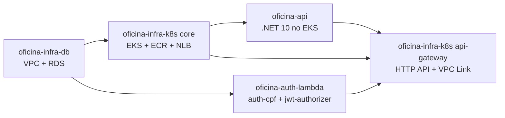
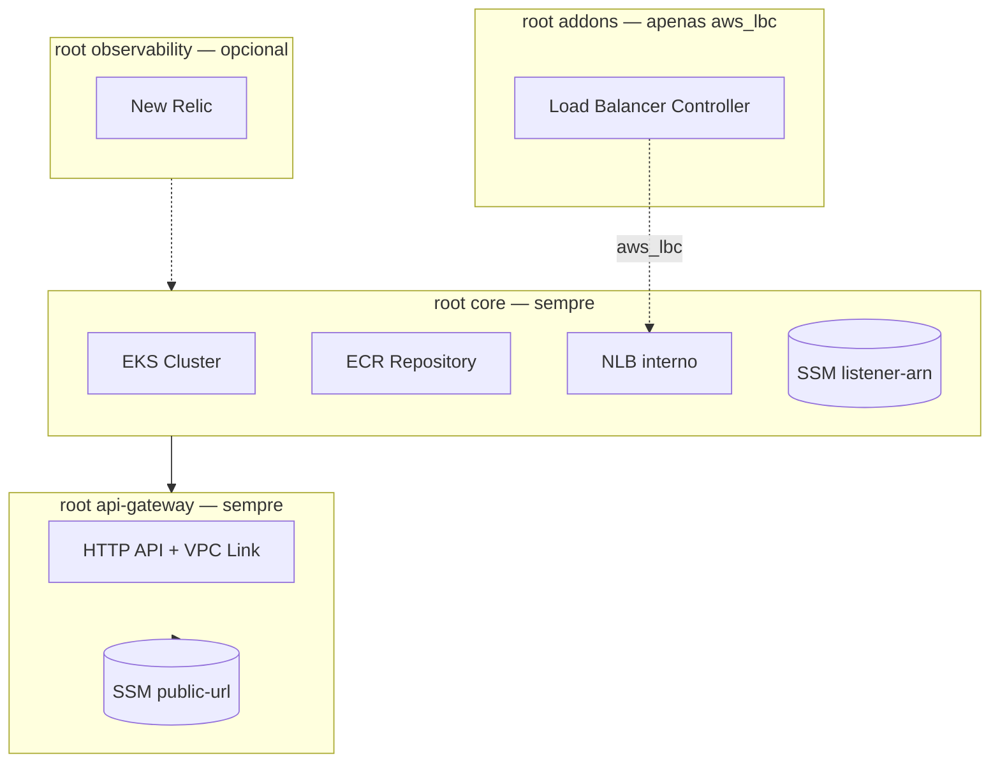

# oficina-infra-k8s

## Visão geral

Repositório que provisiona a camada Kubernetes e a entrada pública da solução Oficina. Contém quatro roots Terraform independentes: cluster EKS e ECR, controlador opcional de Load Balancer, HTTP API com VPC Link e adaptador opcional de observabilidade New Relic.

- Provisiona EKS, Node Group, ECR e o NLB interno (modo padrão).
- Provisiona o API Gateway HTTP, VPC Link e rotas que integram a API e as Lambdas.
- Publica parâmetros SSM consumidos pelos demais repositórios.
- Não constrói imagens, não cria roles IAM de EKS (pré-requisito manual) nem provisiona RDS, VPC ou Lambdas.

## Tecnologias utilizadas

- Terraform
- AWS EKS, ECR e Network Load Balancer
- AWS API Gateway HTTP API e VPC Link
- AWS SSM Parameter Store
- Helm (somente no modo `aws_lbc`)
- New Relic (adaptador opcional)
- GitHub Actions

## Solução integrada

A solução Oficina é composta por 4 repositórios que formam um sistema de gestão de oficina mecânica na AWS.



| Passo | Repositório | Quando aplicar |
|---|---|---|
| 1 | [oficina-infra-db](https://github.com/fabianorodrigues/oficina-infra-db) | sempre |
| 2 | [oficina-infra-k8s](https://github.com/fabianorodrigues/oficina-infra-k8s) — core | sempre |
| 2a | [oficina-infra-k8s](https://github.com/fabianorodrigues/oficina-infra-k8s) — addons | apenas se `LOAD_BALANCER_PROVISIONING_MODE=aws_lbc` |
| 3 | [oficina-api](https://github.com/fabianorodrigues/oficina-api) | sempre |
| 4 | [oficina-auth-lambda](https://github.com/fabianorodrigues/oficina-auth-lambda) | sempre |
| 5 | [oficina-infra-k8s](https://github.com/fabianorodrigues/oficina-infra-k8s) — api-gateway | sempre |
| 6 | [oficina-api](https://github.com/fabianorodrigues/oficina-api) — redeploy | se o pod precisar refletir `public-base-url` em e-mails |
| 7 | [oficina-infra-k8s](https://github.com/fabianorodrigues/oficina-infra-k8s) — observability | opcional — somente após passo 5 |

Cada README detalha apenas a responsabilidade do seu repositório. Para o passo a passo dos demais, consulte os READMEs correspondentes.

## Arquitetura



## Estrutura de roots Terraform

| Root | Propósito | Quando aplicar |
| --- | --- | --- |
| `terraform/` (core) | EKS, Node Group, ECR e NLB interno (modo `terraform_nlb`) | sempre |
| `terraform/addons/` | AWS Load Balancer Controller via Helm | apenas no modo `aws_lbc` |
| `terraform/api-gateway/` | HTTP API, VPC Link, rotas e integrações | sempre, após [oficina-api](https://github.com/fabianorodrigues/oficina-api) e [oficina-auth-lambda](https://github.com/fabianorodrigues/oficina-auth-lambda) |
| `terraform/observability/` | Adaptador New Relic (dashboards, alertas, Synthetic Monitor) | opcional — somente após passo 5 (API Gateway) |

Cada root tem `backend.tf` próprio e state isolado em `s3://<bucket-de-state>/oficina-infra-k8s/<ambiente>/{core|addons|api-gateway|observability}/terraform.tfstate`.

## Pré-requisitos manuais (IAM Roles do EKS)

As roles IAM do EKS **devem pré-existir** antes do deploy — o workflow não as cria. São necessárias duas roles distintas:

**Role do control plane** (`TF_VAR_eks_cluster_role_arn`)

- Trust policy: `eks.amazonaws.com`
- Política gerenciada: `AmazonEKSClusterPolicy`

**Role dos nodes** (`TF_VAR_eks_node_role_arn`)

- Trust policy: `ec2.amazonaws.com`
- Políticas gerenciadas:
  - `AmazonEKSWorkerNodePolicy`
  - `AmazonEKS_CNI_Policy`
  - `AmazonEC2ContainerRegistryReadOnly`

Para listar as roles disponíveis na conta e obter os ARNs:

```powershell
$env:AWS_REGION="<regiao>"

aws iam list-roles --query "Roles[?contains(RoleName,'eks')].{Nome:RoleName,ARN:Arn}" --output table
aws iam get-role --role-name "<nome-da-role>" --query "Role.Arn" --output text
```

## Modos de provisionamento do Load Balancer

A variável `LOAD_BALANCER_PROVISIONING_MODE` define como o NLB é criado:

| Modo | Quem cria o NLB | Quem grava `backend-listener-arn` no SSM | Precisa rodar `addons`? |
| --- | --- | --- | --- |
| `terraform_nlb` (padrão) | Terraform deste repositório (root `core`) | Terraform deste repositório (root `core`) | não |
| `aws_lbc` | AWS Load Balancer Controller (via Kubernetes Service) | Workflow do [oficina-api](https://github.com/fabianorodrigues/oficina-api) após o Service subir | sim |

No modo `aws_lbc`, a variável `TF_VAR_aws_load_balancer_controller_iam_mode` define `node` (padrão, herda da node IAM role) ou `irsa` (role dedicada com OIDC; recomendado).

## Configuração

Configure no GitHub Actions.

### Obrigatório

| Nome | Tipo | Descrição |
| --- | --- | --- |
| `AWS_ACCESS_KEY_ID` | Secret | Credencial AWS |
| `AWS_SECRET_ACCESS_KEY` | Secret | Credencial AWS |
| `AWS_REGION` | Secret | Região AWS |
| `TF_STATE_BUCKET` | Secret | Bucket S3 do state; criado automaticamente pelo workflow se não existir |
| `TF_VAR_eks_cluster_role_arn` | Secret | ARN da role do control plane EKS (ver pré-requisitos) |
| `TF_VAR_eks_node_role_arn` | Secret | ARN da role do node group (ver pré-requisitos) |

### Opcional / com default

| Nome | Tipo | Default | Descrição |
| --- | --- | --- | --- |
| `AWS_SESSION_TOKEN` | Secret | — | Credenciais temporárias (STS) |
| `PROJECT_NAME` | Variable | `oficina` | Prefixo lógico |
| `ENVIRONMENT` | Variable | `dev` | Ambiente |
| `EKS_CLUSTER_NAME` | Variable | `oficina-eks` | Nome do cluster |
| `ECR_REPOSITORY_NAME` | Variable | `oficina-api` | Nome do repositório ECR |
| `LOAD_BALANCER_PROVISIONING_MODE` | Variable | `terraform_nlb` | `terraform_nlb` ou `aws_lbc` |
| `API_NODE_PORT` | Variable | `30080` | NodePort da API (faixa 30000-32767) |
| `TF_VAR_aws_load_balancer_controller_iam_mode` | Variable | `node` | `node` ou `irsa`; usado apenas no modo `aws_lbc` |
| `AUTH_FUNCTION_NAME` | Variable | `oficina-auth-cpf` | Nome da Lambda de autenticação (consumida pelo root `api-gateway`) |
| `AUTHORIZER_FUNCTION_NAME` | Variable | `oficina-jwt-authorizer` | Nome da Lambda authorizer |

A regra de Security Group do NodePort restringe a faixa `30000-32767` ao CIDR da VPC. Não altere para `0.0.0.0/0`.

## Execução

### Root core (passo 2)

Pull requests executam `Terraform Check` com `fmt`, `init -backend=false` e `validate`.

Após o merge na `main`, execute manualmente:

```text
GitHub Actions > Terraform Apply > Run workflow
```

No modo `terraform_nlb`, o job de addons é ignorado. O Target Group permanece sem targets saudáveis até o deploy do [oficina-api](https://github.com/fabianorodrigues/oficina-api); isso é esperado.

No modo `aws_lbc`, o mesmo workflow também aplica os addons (AWS Load Balancer Controller via Helm).

### Root api-gateway (passo 5)

Após o deploy da API e das Lambdas, execute:

```text
GitHub Actions > Terraform API Gateway Apply > Run workflow
```

### Root observability (opcional)

Pull requests e push na `main` executam apenas `validate` e `plan`. O `apply` exige `workflow_dispatch` com o input `apply=true`.

Execute o `apply` somente após o passo 5, com API Gateway ativo e URL pública validada. O Synthetic Monitor usa `API_GATEWAY_URL`, disponível apenas depois do root `api-gateway`, e dashboards/APM só terão dados úteis após a API gerar tráfego real.

## Validação

### Console — após o root core

- Em EKS, confirme cluster e node group ativos.
- Em ECR, confirme o repositório da API.
- Em EC2 > Load Balancers (modo `terraform_nlb`), confirme o NLB interno.
- Em SSM Parameter Store (modo `terraform_nlb`), confirme `/${PROJECT_NAME}/${ENVIRONMENT}/api/backend-listener-arn`.
- Em Security Groups, confirme NodePort restrito ao CIDR da VPC.

### Console — após o root api-gateway

- Em API Gateway, confirme HTTP API, VPC Link e rotas (`POST /api/auth/cpf`, `GET /health`, `ANY /api/{proxy+}`).
- Em SSM Parameter Store, confirme `/${PROJECT_NAME}/${ENVIRONMENT}/api/public-base-url`.

### CLI (PowerShell) — após o root core

```powershell
$env:AWS_REGION="<regiao>"
$env:ENVIRONMENT="<ambiente>"
$env:PROJECT_NAME="oficina"
$env:EKS_CLUSTER_NAME="<nome-do-cluster>"
$env:ECR_REPOSITORY_NAME="<nome-do-repositorio-ecr>"

aws eks describe-cluster --name $env:EKS_CLUSTER_NAME --region $env:AWS_REGION --query "cluster.status"
aws eks describe-nodegroup --cluster-name $env:EKS_CLUSTER_NAME --nodegroup-name "$($env:PROJECT_NAME)-node-group" --region $env:AWS_REGION --query "nodegroup.status"
aws ecr describe-repositories --repository-names $env:ECR_REPOSITORY_NAME --region $env:AWS_REGION --query "length(repositories)"
aws ssm get-parameter --name "/$($env:PROJECT_NAME)/$($env:ENVIRONMENT)/api/backend-listener-arn" --region $env:AWS_REGION --query "Parameter.Name"
```

### CLI (PowerShell) — após o root api-gateway

```powershell
aws apigatewayv2 get-apis --region $env:AWS_REGION --query "Items[?contains(Name,'$($env:PROJECT_NAME)')].{Nome:Name,Protocolo:ProtocolType}"
aws ssm get-parameter --name "/$($env:PROJECT_NAME)/$($env:ENVIRONMENT)/api/public-base-url" --region $env:AWS_REGION --query "Parameter.Name"
```

## Observabilidade

O padrão da solução é independente de fornecedor: aplicações expõem sinais por OpenTelemetry/OTLP e logs JSON com campos canônicos como `service.name`, `correlationId` e `eventType`. O root `terraform/observability` é apenas um adaptador opcional para validar esses sinais no New Relic, provisionando dashboards, alertas, workflow de notificação e Synthetic Monitor. Ele é o passo 7 da solução: opcional, mas deve ser aplicado somente após o passo 5 (API Gateway) estar concluído. O padrão é seguro: `enable_new_relic=false` permite `validate` sem credenciais.

### Configurar

### Obrigatório

| Nome | Tipo | Descrição |
| --- | --- | --- |
| `NEW_RELIC_LICENSE_KEY` | Secret | License key usada pela Kubernetes integration |
| `NEW_RELIC_USER_API_KEY` | Secret | User API key usada pelo provider Terraform New Relic |
| `NEW_RELIC_ACCOUNT_ID` | Secret | Account ID New Relic |
| `NEW_RELIC_NOTIFICATION_EMAIL` | Secret | E-mail destino das notificações |

### Opcional / com default

| Nome | Tipo | Default | Descrição |
| --- | --- | --- | --- |
| `NEW_RELIC_REGION` | Variable | `US` | `US` ou `EU` |
| `API_GATEWAY_URL` | Secret ou Variable | vazio (desabilita Synthetic) | URL pública criada pelo root `api-gateway` e usada pelo Synthetic Monitor |

A variável Terraform `enable_new_relic` deve ser `true` para criar recursos no New Relic. Para que APM e traces do [oficina-api](https://github.com/fabianorodrigues/oficina-api) cheguem ao New Relic, configure o workflow `deploy-api` com as variáveis OTLP descritas no README da API.

### Executar

Execute somente após o passo 5 (API Gateway) estar concluído e a URL pública responder em `/health`.

```text
GitHub Actions > Terraform Observability > Run workflow > apply = true
```

Quando aplicado, o workflow instala o chart `nri-bundle` no namespace `newrelic`, cria dashboards, condições de alerta, workflow de notificação e Synthetic Monitor. Os valores sensíveis são mascarados pelo workflow.

### Validar

Console New Relic:

- **APM**: confirme entidade `oficina-api` com `service.name = 'oficina-api'` e transações em `/api/*` e `/health`.
- **Logs**: filtre por `correlationId` e `eventType` (`OrdemServicoCriada`, `OrdemServicoStatusAlterado`, `OrdemServicoFalha`, `EmailOrcamentoFalha`) quando a coleta de logs do Kubernetes estiver habilitada.
- **Kubernetes**: confirme cluster, nodes, pods e logs dos pods sob a integração `nri-bundle`.
- **Dashboards**: latência da API, erros 5xx, uptime, CPU e memória Kubernetes, volume diário de OS, tempo médio por status, falhas de OS.
- **Alertas**: force uma condição controlada ou reduza thresholds temporariamente e confirme a abertura da issue.
- **Synthetic**: quando `API_GATEWAY_URL` estiver configurada, confirme o monitor de `/health` validando a string `Healthy`.

CLI (PowerShell) — componentes Kubernetes do `nri-bundle`:

```powershell
$env:AWS_REGION="<regiao>"
$env:EKS_CLUSTER_NAME="<nome-do-cluster>"

aws eks update-kubeconfig --name $env:EKS_CLUSTER_NAME --region $env:AWS_REGION
kubectl get pods -n newrelic
kubectl get daemonset -n newrelic
```

## Próxima etapa

No modo `terraform_nlb`, executar [oficina-api](https://github.com/fabianorodrigues/oficina-api). No modo `aws_lbc`, executar o root `terraform/addons` antes da API. Em seguida, publicar [oficina-auth-lambda](https://github.com/fabianorodrigues/oficina-auth-lambda), voltar a este repositório para aplicar o root `terraform/api-gateway` e, somente depois da URL pública validada, aplicar o root `terraform/observability` se New Relic for usado.
