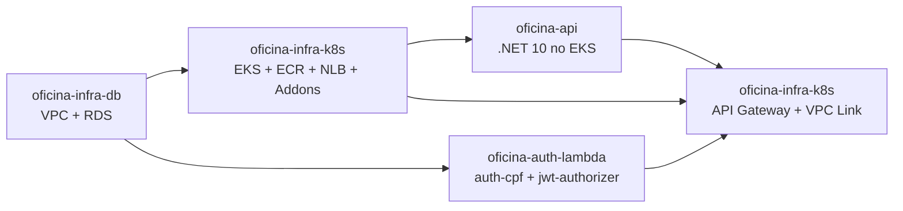
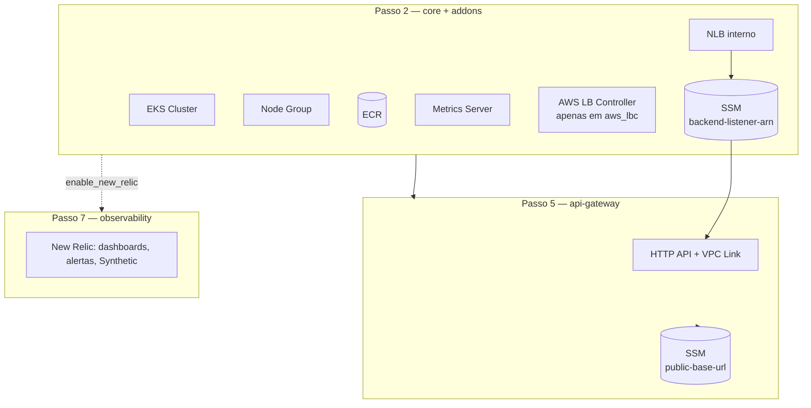

# oficina-infra-k8s

Camada Kubernetes e entrada pública da solução Oficina na AWS.

[]()
[]()
[]()
[]()

## Sumário

- 🎯 [Visão geral](#visão-geral)
- 🧩 [Solução integrada](#solução-integrada)
- 🏗️ [Arquitetura](#arquitetura)
- 🔄 [Consumido e gerado](#consumido-e-gerado)
- 🔑 [Pré-requisitos manuais](#pré-requisitos-manuais)
- 🔀 [Modos do Load Balancer](#modos-do-load-balancer)
- ⚙️ [Configuração](#configuração)
- ▶️ [Execução](#execução)
  - [Passo 2 — core + addons](#passo-2--core--addons)
  - [Passo 5 — api-gateway](#passo-5--api-gateway)
  - [Passo 7 — observability](#passo-7--observability-opcional)
- ✅ [Validação](#validação)
- 📊 [Observabilidade](#observabilidade)
- ➡️ [Próxima etapa](#próxima-etapa)

---

## <a id="visão-geral"></a> 🎯 Visão geral

**Passos 2, 5 e 7** da solução Oficina. Quatro roots Terraform independentes que provisionam o ambiente Kubernetes, a entrada pública e a observabilidade opcional da solução.

- **core**: EKS, Node Group, ECR e NLB interno (modo `terraform_nlb`).
- **addons**: Metrics Server via Helm (sempre) e AWS Load Balancer Controller via Helm (apenas em modo `aws_lbc`).
- **api-gateway**: HTTP API, VPC Link, rotas e integrações com a API e as Lambdas.
- **observability**: adaptador opcional New Relic (dashboards, alertas, Synthetic Monitor).

Não constrói imagens, não cria roles IAM do EKS (pré-requisito manual) nem provisiona RDS, VPC ou Lambdas.

**Tecnologias:** Terraform, AWS EKS/ECR/NLB/API Gateway/SSM, Helm, New Relic (adapter), GitHub Actions.

Cada root tem `backend.tf` próprio. State remoto em `s3://<bucket-de-state>/oficina-infra-k8s/<ambiente>/{core|addons|api-gateway|observability}/terraform.tfstate`.

---

## <a id="solução-integrada"></a> 🧩 Solução integrada

A solução Oficina é composta por 4 repositórios que formam um sistema de gestão de oficina mecânica na AWS.



| Passo | Repositório | Quando |
|---|---|---|
| 1 | [oficina-infra-db](https://github.com/fabianorodrigues/oficina-infra-db) | sempre |
| **2** | **[oficina-infra-k8s](https://github.com/fabianorodrigues/oficina-infra-k8s) — core + addons** | **sempre — este repositório** |
| 3 | [oficina-api](https://github.com/fabianorodrigues/oficina-api) — 1º deploy | sempre |
| 4 | [oficina-auth-lambda](https://github.com/fabianorodrigues/oficina-auth-lambda) | sempre |
| **5** | **[oficina-infra-k8s](https://github.com/fabianorodrigues/oficina-infra-k8s) — api-gateway** | **sempre — este repositório** |
| 6 | [oficina-api](https://github.com/fabianorodrigues/oficina-api) — redeploy | opcional, se `public-base-url` precisa entrar nos e-mails |
| **7** | **[oficina-infra-k8s](https://github.com/fabianorodrigues/oficina-infra-k8s) — observability** | **opcional — este repositório, após o passo 5** |

> [!NOTE]
> No passo 2, o Metrics Server é sempre instalado (HPA da API depende dele); o AWS Load Balancer Controller só é instalado quando `LOAD_BALANCER_PROVISIONING_MODE=aws_lbc`.

---

## <a id="arquitetura"></a> 🏗️ Arquitetura



---

## <a id="consumido-e-gerado"></a> 🔄 Consumido e gerado

**Consome:**

| Origem | Valores | Onde |
| --- | --- | --- |
| `oficina-infra-db` (remote state) | `vpc_id`, `vpc_cidr_block`, `public_subnet_ids`, `private_subnet_ids` | core, api-gateway |
| `oficina-api` (deploy) | Listener ARN gravado no SSM (apenas em `aws_lbc`) | api-gateway |
| `oficina-auth-lambda` (deploy) | Funções `auth-cpf` e `jwt-authorizer` (por nome) | api-gateway |

**Gera:**

| Saída | Consumido por |
| --- | --- |
| `ecr_repository_url`, `cluster_name` (outputs do core) | `oficina-api` (deploy) |
| SSM `/<projeto>/<ambiente>/api/backend-listener-arn` (em `terraform_nlb`) | api-gateway deste repositório |
| SSM `/<projeto>/<ambiente>/api/public-base-url` | `oficina-api` (e-mails) e observability deste repositório |

---

## <a id="pré-requisitos-manuais"></a> 🔑 Pré-requisitos manuais

> [!IMPORTANT]
> As duas IAM Roles do EKS abaixo **devem existir antes** do deploy. O Terraform não as cria.

| Role | Trust | Políticas gerenciadas | Secret |
| --- | --- | --- | --- |
| Control plane | `eks.amazonaws.com` | `AmazonEKSClusterPolicy` | `TF_VAR_eks_cluster_role_arn` |
| Node group | `ec2.amazonaws.com` | `AmazonEKSWorkerNodePolicy`, `AmazonEKS_CNI_Policy`, `AmazonEC2ContainerRegistryReadOnly` | `TF_VAR_eks_node_role_arn` |

Listar roles e ARNs:

```powershell
$env:AWS_REGION="<regiao>"

aws iam list-roles --query "Roles[?contains(RoleName,'eks')].{Nome:RoleName,ARN:Arn}" --output table
aws iam get-role --role-name "<nome-da-role>" --query "Role.Arn" --output text
```

---

## <a id="modos-do-load-balancer"></a> 🔀 Modos do Load Balancer

A variável `LOAD_BALANCER_PROVISIONING_MODE` define quem cria o NLB:

| Modo | Cria o NLB | Grava `backend-listener-arn` no SSM | Addons |
| --- | --- | --- | --- |
| `terraform_nlb` (padrão) | core deste repositório | core deste repositório | Metrics Server |
| `aws_lbc` | AWS Load Balancer Controller via Service do `oficina-api` | workflow do `oficina-api` após o Service subir | Metrics Server + AWS LBC |

No modo `aws_lbc`, `TF_VAR_aws_load_balancer_controller_iam_mode` define `node` (padrão, herda da node IAM role) ou `irsa` (role dedicada com OIDC; recomendado).

---

## <a id="configuração"></a> ⚙️ Configuração

Configure em **GitHub > Settings > Secrets and variables > Actions**.

### Core + addons (passo 2)

**Obrigatórios**

| Nome | Tipo | Descrição |
| --- | --- | --- |
| `AWS_ACCESS_KEY_ID`, `AWS_SECRET_ACCESS_KEY`, `AWS_REGION` | Secret | Credenciais AWS |
| `TF_STATE_BUCKET` | Secret | Bucket S3 do state |
| `TF_VAR_eks_cluster_role_arn` | Secret | ARN da role do control plane (ver pré-requisitos) |
| `TF_VAR_eks_node_role_arn` | Secret | ARN da role do node group (ver pré-requisitos) |

**Opcionais**

| Nome | Tipo | Default | Descrição |
| --- | --- | --- | --- |
| `AWS_SESSION_TOKEN` | Secret | — | Credenciais temporárias (STS) |
| `PROJECT_NAME` | Variable | `oficina` | Prefixo lógico |
| `ENVIRONMENT` | Variable | `dev` | Ambiente |
| `EKS_CLUSTER_NAME` | Variable | `oficina-eks` | Nome do cluster |
| `ECR_REPOSITORY_NAME` | Variable | `oficina-api` | Nome do repositório ECR |
| `LOAD_BALANCER_PROVISIONING_MODE` | Variable | `terraform_nlb` | `terraform_nlb` ou `aws_lbc` |
| `API_NODE_PORT` | Variable | `30080` | NodePort da API (30000–32767) |
| `TF_VAR_aws_load_balancer_controller_iam_mode` | Variable | `node` | `node` ou `irsa` (somente em `aws_lbc`) |
| `TF_VAR_metrics_server_chart_version` | Variable | `3.13.0` | Versão do chart Metrics Server |

### API Gateway (passo 5)

Reaproveita as credenciais AWS e `TF_STATE_BUCKET`. Adicional:

| Nome | Tipo | Default | Descrição |
| --- | --- | --- | --- |
| `AUTH_FUNCTION_NAME` | Variable | `oficina-auth-cpf` | Nome da Lambda de autenticação |
| `AUTHORIZER_FUNCTION_NAME` | Variable | `oficina-jwt-authorizer` | Nome da Lambda authorizer |

> [!IMPORTANT]
> Antes de aplicar o api-gateway, o SSM Parameter `/<projeto>/<ambiente>/api/backend-listener-arn` deve existir (criado pelo core em `terraform_nlb` ou pelo deploy da API em `aws_lbc`).

### Observability (passo 7, opcional)

**Obrigatórios** (apenas quando `enable_new_relic=true`)

| Nome | Tipo | Descrição |
| --- | --- | --- |
| `NEW_RELIC_LICENSE_KEY` | Secret | License key da Kubernetes integration |
| `NEW_RELIC_USER_API_KEY` | Secret | User API key do provider Terraform New Relic |
| `NEW_RELIC_ACCOUNT_ID` | Secret | Account ID New Relic |
| `NEW_RELIC_NOTIFICATION_EMAIL` | Secret | E-mail destino das notificações |

**Opcionais**

| Nome | Tipo | Default | Descrição |
| --- | --- | --- | --- |
| `NEW_RELIC_REGION` | Variable | `US` | `US` ou `EU` |
| `API_GATEWAY_URL` | Secret ou Variable | vazio | Override; se vazio, busca `public-base-url` no SSM |

> [!NOTE]
> `enable_new_relic=false` (padrão) permite rodar `validate` sem credenciais. Aplicar somente após o passo 5 concluído e `/health` respondendo.

---

## <a id="execução"></a> ▶️ Execução

### Passo 2 — core + addons

Um único workflow aplica `core` e `addons` em jobs sequenciais.

```text
GitHub Actions > Terraform Apply > Run workflow
```

Comportamento:

- **core**: provisiona EKS, Node Group, ECR e (em `terraform_nlb`) NLB + Target Group + Listener + SSM. Em `aws_lbc + irsa`, cria também OIDC provider e IAM role do controller.
- **addons**: instala Metrics Server (HPA e `kubectl top`). Em `aws_lbc`, instala também o AWS Load Balancer Controller.

> [!NOTE]
> Em `terraform_nlb`, o Target Group fica sem targets saudáveis até o deploy do `oficina-api`. Isso é esperado.

> [!TIP]
> **Checkpoint antes do passo 3:** cluster EKS com `status=Active`, ECR criado e (em `terraform_nlb`) SSM `/<projeto>/<ambiente>/api/backend-listener-arn` presente.

### Passo 5 — api-gateway

Após `oficina-api` (passo 3) e `oficina-auth-lambda` (passo 4):

```text
GitHub Actions > Terraform API Gateway Apply > Run workflow
```

Provisiona HTTP API, VPC Link, rotas (`POST /api/auth/cpf`, `GET /health`, `ANY /api/{proxy+}`), JWT Authorizer e grava `public-base-url` no SSM.

> [!TIP]
> **Checkpoint antes do passo 6/7:** HTTP API com as três rotas acima, JWT Authorizer ativo na rota `ANY /api/{proxy+}` e SSM `/<projeto>/<ambiente>/api/public-base-url` presente. Os controllers `MeusOrcamentos` e `MinhasOrdensServico` da API só funcionam com JWT emitido pela Lambda `oficina-auth-cpf` (passo 4).

### Passo 7 — observability (opcional)

Pull requests e push na `main` executam apenas `validate`. `workflow_dispatch` com `apply=false` executa `plan`; `apply=true` aplica.

```text
GitHub Actions > Terraform Observability > Run workflow > apply=true
```

Instala `nri-bundle` no namespace `newrelic` e provisiona dashboards, alertas e Synthetic Monitor (este último apenas quando há URL pública disponível).

---

## <a id="validação"></a> ✅ Validação

### Após o passo 2

**Console**

- **EKS**: cluster e node group ativos; Metrics Server em `kube-system`.
- **ECR**: repositório da API criado.
- **EC2 > Load Balancers** (modo `terraform_nlb`): NLB interno.
- **SSM Parameter Store** (modo `terraform_nlb`): `/<projeto>/<ambiente>/api/backend-listener-arn`.
- **Security Groups**: NodePort restrito ao CIDR da VPC.

**CLI (PowerShell)**

```powershell
$env:AWS_REGION="<regiao>"
$env:ENVIRONMENT="<ambiente>"
$env:PROJECT_NAME="oficina"
$env:EKS_CLUSTER_NAME="<nome-do-cluster>"
$env:ECR_REPOSITORY_NAME="<nome-do-repositorio-ecr>"

aws eks describe-cluster --name $env:EKS_CLUSTER_NAME --region $env:AWS_REGION --query "cluster.status"
aws eks describe-nodegroup --cluster-name $env:EKS_CLUSTER_NAME --nodegroup-name "$($env:PROJECT_NAME)-node-group" --region $env:AWS_REGION --query "nodegroup.status"
aws eks update-kubeconfig --name $env:EKS_CLUSTER_NAME --region $env:AWS_REGION
kubectl get deployment metrics-server -n kube-system
kubectl get apiservice v1beta1.metrics.k8s.io
aws ecr describe-repositories --repository-names $env:ECR_REPOSITORY_NAME --region $env:AWS_REGION --query "length(repositories)"
aws ssm get-parameter --name "/$($env:PROJECT_NAME)/$($env:ENVIRONMENT)/api/backend-listener-arn" --region $env:AWS_REGION --query "Parameter.Name"
```

### Após o passo 5

**Console**

- **API Gateway**: HTTP API, VPC Link e rotas `POST /api/auth/cpf`, `GET /health`, `ANY /api/{proxy+}`.
- **SSM Parameter Store**: `/<projeto>/<ambiente>/api/public-base-url`.

**CLI (PowerShell)**

```powershell
aws apigatewayv2 get-apis --region $env:AWS_REGION --query "Items[?contains(Name,'$($env:PROJECT_NAME)')].{Nome:Name,Protocolo:ProtocolType}"
aws ssm get-parameter --name "/$($env:PROJECT_NAME)/$($env:ENVIRONMENT)/api/public-base-url" --region $env:AWS_REGION --query "Parameter.Name"
```

---

## <a id="observabilidade"></a> 📊 Observabilidade

O padrão da solução é independente de fornecedor: aplicações expõem sinais via OpenTelemetry/OTLP e logs JSON com `service.name`, `correlationId` e `eventType`. O root `terraform/observability` é o **adaptador opcional** que valida esses sinais no New Relic.

### Configurar

Ver tabelas da [seção de Configuração — Observability](#observability-passo-7-opcional). Para APM/traces do `oficina-api` chegarem ao New Relic, configure também as variáveis OTLP no `deploy-api` do [oficina-api](https://github.com/fabianorodrigues/oficina-api).

### Validar

**Console New Relic**

- **APM**: entidade `oficina-api` com transações em `/api/*` e `/health`.
- **Logs**: filtre por `correlationId` e por `eventType` (`OrdemServicoCriada`, `OrdemServicoStatusAlterado`, `OrdemServicoFalha`, `EmailOrcamentoFalha`).
- **Kubernetes**: cluster, nodes, pods e logs via `nri-bundle`.
- **Dashboards**: latência, 5xx, uptime, CPU/memória, falhas de OS.
- **Synthetic**: monitor de `/health` quando a URL pública estiver disponível.

**CLI (PowerShell)**

```powershell
$env:AWS_REGION="<regiao>"
$env:EKS_CLUSTER_NAME="<nome-do-cluster>"

aws eks update-kubeconfig --name $env:EKS_CLUSTER_NAME --region $env:AWS_REGION
kubectl get pods -n newrelic
kubectl get daemonset -n newrelic
```

---

## <a id="próxima-etapa"></a> ➡️ Próxima etapa

Após o **passo 2** concluído, executar [oficina-api](https://github.com/fabianorodrigues/oficina-api) — **passo 3**. Em seguida [oficina-auth-lambda](https://github.com/fabianorodrigues/oficina-auth-lambda) — **passo 4** — e voltar a este repositório para o **passo 5 (api-gateway)**. O **passo 7 (observability)** é opcional e só deve ser aplicado depois do passo 5 com `/health` respondendo.
